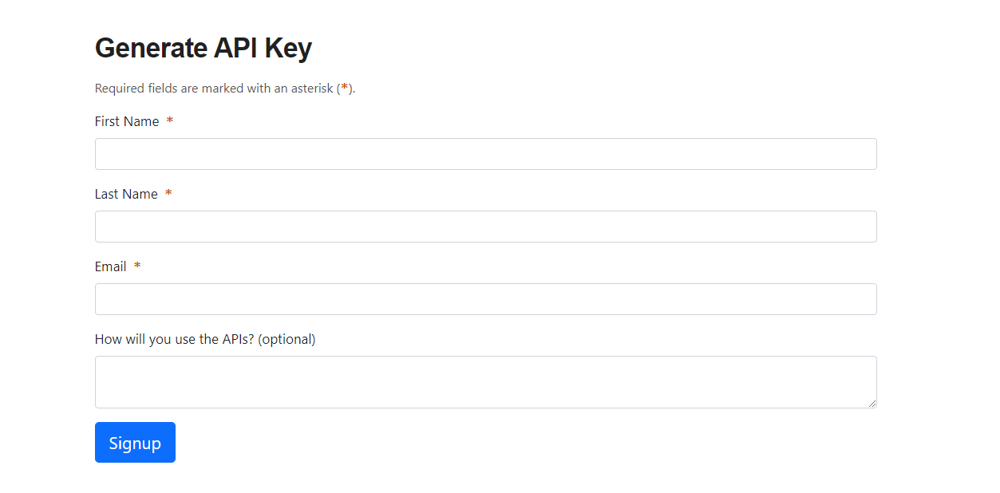

# Asteroid Radar

Asteroid Radar is an Android app to view the asteroids detected by NASA that pass near Earth. You can 
view all the detected asteroids given a period of time with data such as the size, velocity,
distance to earth and if they are potentially hazardous. 

## Project Overview

This project consists of two screens:  
- Main screen with a list of clickable asteroids implemented with *RecyclerView* with its adapter.
- Details screen that displays the selected asteroid data once it’s clicked in the Main screen. 

The app has been implemented with the following techniques: 
- *Retrofit* to make api calls to Near Earth Object Web Service.
- *Moshi* and *retrofit-converter-scalars* which handles the deserialization of the returned 
  JSON to Kotlin data objects.
- *Picasso* Library to load and cache picture of the day by URL to show on Main screen.

It leverages the following components from the Jetpack library:
- *ViewModel* and *LiveData*
- *DataBinding* with binding adapters
- *Navigation* with the SafeArgs plugin for parameter passing between fragments

This app also uses *Room* persistence library and Repository layer to create an *offline cache*, 
fetching and displaying the asteroids from the database sorted by date. 

In addition, using a *WorkManager* for scheduling periodic work, the app downloads and saves 
asteroids in background once a day when the device is charging and wifi is enabled.

## Using Asteroid Radar App
The first step is to get an API Key from NASA. Follow the instructions as listed.

1. Go to the following [URL](https://api.nasa.gov/), scroll down a little and you are going to
   see this:




2. Fill the required fields, click the Signup button and you will get a API key (the API Key is also
   going to be sent to your email). Your API key will be used to send requests to NASA servers to 
   get data about asteroids. 

3. In order to use this app you need to clone the project from this repo, open in Android Studio and 
   insert your API key into "local.properties" file like so:
   ``` apiKey="YOUR_API_KEY_HERE"```

4. Now you should be able to run and enjoy the app. 


## Screenshots


 


